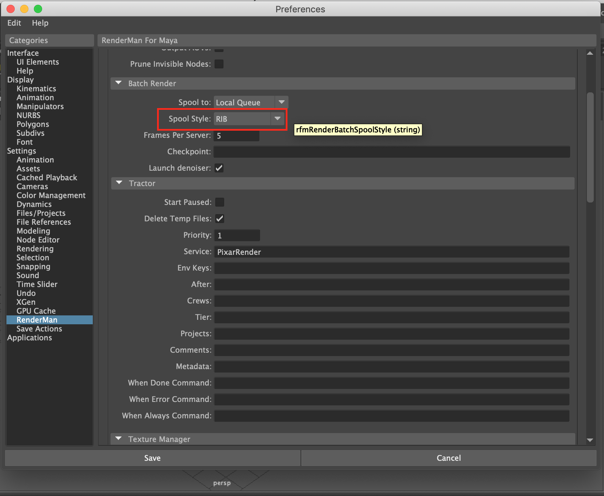
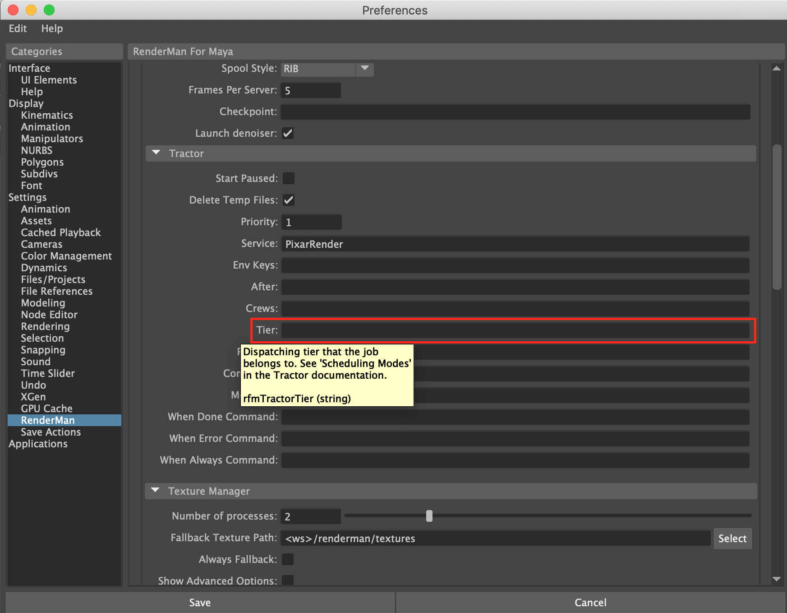

# RenderMan 23.1 Pref Variables
## For use in Maya 2019

_____________________________________________________________

Name: `rfmRenderThreads`  
Type: `int`  
Default: -2  
Label: 'Render Threads:'  
Page: 'Render/Threads  
Description: The number of preview or IPR rendering threads. A negative number means to use all but `n` processors.

Name: `rfmBatchThreads`  
Type: `int`  
Default: 0  
Label: 'Batch Threads:'  
Page: 'Render/Threads'  
Description: The number of threads for batch renders. A negative number means to use all but n processors, and zero means all processors.

Name: `rfmRenderIprDestination`  
Type: `string`  
Default: 'Pixar It'  
Label: 'Render to:'  
Page: 'Render/IPR Render'
Widget: popup  
Options: 'Maya Render View|Pixar It'  
Description: Interactive renders can be viewed in Maya's Render View or in Pixar's It application.

Name: `rfmRenderIprAOVs`  
Type: `int`  
Default: 0  
Label: 'Output AOVs:'  
Page: 'Render/IPR Render'  
Widget: 'checkBox'  
Description: AOVs can be output during IPR but they may decrease performance and interactivity.

Name: `rfmPruneInvisible`  
Type: `int`  
Default: 0  
Label: 'Prune Invisible Nodes:'  
Page: 'Render/IPR Render'  
Widget: 'checkBox'  
Description: Invisible objects are not pruned by default during IPR so that they can easily be made visible interactively. For non-IPR renders invisible and templated objects are always pruned.

Name: `rfmRenderBatchQueue`  
Type: `string`  
Default: 'Local Queue'  
Label: 'Spool to:'  
Page: 'Render/Batch Render'
Widget: 'popup'  
Options: 'Local Queue|Tractor'

Name: `rfmRenderBatchSpoolStyle`  
Type: `string`  
Default: 'Maya Batch'  
Label: 'Spool Style:'  
Page: 'Render/Batch Render'  
Widget: 'popup'  
Options: 'Maya Batch|RIB'

Name: `rfmRenderBatchFrameChunk`  
Type: `int`  
Default: 5  
Label: 'Frames Per Server:'  
Page: 'Render/Batch Render'  
Description: The number of frames that should be split to a separate batch render process. For example, a 100 frame sequence with a frame chunk of 10 will result in 10 different batch render processes. Each of these batch render processes could potentially be ran on a separate Tractor blade, simultaneously, depending on your render farm setup.

Name: `rfmRenderBatchCheckpoint`  
Type: `string`  
Default: ''  
Label: 'Checkpoint:'  
Page: 'Render/Batch Render'  
Description: Checkpoint interval and optional exit time. This can be specified with an interval measured either in a number of increments (i.e., passes over the image), or by the elapsed wall clock time. 
 For convenience the time-based interval can also be specified with a suffix of s, m, h, or d for seconds, minutes, hours, and days respectively. 
Examples:
<ul><li>10i,1h - Deposit a checkpoint image at every 10 increments, stopping the render in 1 hour.</li>
<li>1m,5h - Deposit a checkpoint image at every minute, stopping the render in 5 hours.</li></ul>

Name: `rfmRenderBatchLaunchDenoiser`  
Type: `int`  
Default: 1  
Label: 'Launch denoiser:'  
Page: 'Render/Batch Render'  
Widget: 'checkBox'  
Description: If enabled, denoising tasks will be added to the render job and launched as usual. If not, images will still be computed with the required AOVs but no denoising will take place.

Name: `rfmTractorPaused`  
Type: `int`  
Default: 0  
Label: 'Start Paused:'  
Page: 'Render/Batch Render/Tractor'  
Widget: 'checkBox'  
Description: Job will be set to paused when spooled.

Name: `rfmTractorCleanup`  
Type: `int`  
Default: 1  
Label: 'Delete Temp Files:'  
Page: 'Render/Batch Render/Tractor'  
Widget: 'checkBox'  
Description: Job will clean up any temporary files needed for batch rendering.

Name: `rfmTractorPriority`  
Type: `int`  
Default: 1  
Label: 'Priority:'  
Page: 'Render/Batch Render/Tractor'  
'page_open': 'false'  
Description: Priority for your job.

Name: `rfmTractorService`  
Type: `string`  
Default: 'PixarRender'  
Label: 'Service:'  
Page: 'Render/Batch Render/Tractor'  
Description: Service keys for your job.

Name: `rfmTractorEnvKey`  
Type: `string`  
Default: ''  
Label: 'Env Keys:'  
Page: 'Render/Batch Render/Tractor'  
Description: Multiple keys can be specified and should be space separated.

These environment keys are
recognized by LocalQueue and Tractor out of box:
<ul><li>maya-* (eg. maya-2018)
<li>rfm-* (eg. rfm-22.0)
<li>rmantree=* (eg. rmantree=$RMANTREE)
<li>rfmtree=* (eg. rfmtree=$RFMTREE)</ul>

Name: `rfmTractorAfter`  
Type: `string`  
Default: ''  
Label: 'After:'  
Page: 'Render/Batch Render/Tractor'  
Description: Delay start of job processing until given time 
Format: MONTH/DAY HOUR:MINUTES 
Ex: 11/24 13:45

Name: `rfmTractorCrews`  
Type: `string`,
Default: ''  
Label: 'Crews:'  
Page: 'Render/Batch Render/Tractor'  
Description: List of crews. See 'Crews' in the Tractor documentation.

Name: `rfmTractorTier`  
Type: `string`  
Default: ''  
Label: 'Tier:'  
Page: 'Render/Batch Render/Tractor'  
Description: Dispatching tier that the job belongs to. See Scheduling Modes' in the Tractor documentation.

Name: `rfmTractorProjects`  
Type: `string`  
Default: ''  
Label: 'Projects:'  
Page: 'Render/Batch Render/Tractor'  
Description: Project that job belongs to. See 'Limits Configuration' in the Tractor documentation.

Name: `rfmTractorComment`  
Type: `string`  
Default: ''  
Label: 'Comments:'  
Page: 'Render/Batch Render/Tractor'  
Description: Additional comment about the job.

Name: `rfmTractorMetaData`  
Type: `string`  
Default: '', Label: 'Metadata:'  
Page: 'Render/Batch Render/Tractor'  
Description: Meta data to add to the job.

Name: `rfmTractorWhenDone`  
Type: `string`  
Default: '', Label: 'When Done Command:'  
Page: 'Render/Batch Render/Tractor'  
Description: Command to run when job completes withour error.

Name: `rfmTractorWhenError`  
Type: `string`  
Default: ''  
Label: 'When Error Command:'  
Page: 'Render/Batch Render/Tractor'  
Description: Command to run if there is an error executing the job.

Name: `rfmTractorWhenAlways`  
Type: `string`  
Default: ''  
Label: 'When Always Command:'  
Page: 'Render/Batch Render/Tractor'  
Description: Command to run regardless if job completes with or without errors.

Name: `rfmTxManagerWorkers`  
Type: `int`  
Default: 2  
Label: 'Number of processes:'  
Page: 'Render/Texture Manager'  
min: 1  
max: 6,  
Description: Number of txmake processes to launch in parallel. Default to 2 (assuming a typical 4-cores computer) You should only increase this if you have more than 8 physical cores.

Name: `rfmTxManagerFallbackPath`  
Type: `string`  
Widget: 'fileInput'  
Options: 'directory'  
Default: `<ws>/renderman/textures`  
Label: 'Fallback Texture Path:'  
Page: 'Render/Texture Manager'  
Description: By default, the \*.tex file will be written in the same directory as the source image. If this directory is not writable, the texture manager will write to the fallback directory instead.

Name: `rfmTxManagerFallbackAlways`  
Type: `int`  
Widget: 'checkBox'  
Default: 0  
Label: 'Always Fallback:'  
Page: 'Render/Texture Manager'  
Description: If on, we always use the fallback path to write textures.

Name: `rfmTxManagerShowAdvanced`  
Type: `int`  
Widget: 'checkBox'  
Default: 0  
Label: 'Show Advanced Options:'  
Page: 'Render/Texture Manager'  
Description: Show advanced options that affect texture conversion.

Name: `rfmTxManagerTexExtensions`  
Type: `string`  
Default: 'tex tx txr ptx ptex'  
Label: 'Texture Extensions:'  
Page: 'Render/Texture Manager'  
Description: ("Any file with one of these extensions will not be converted by the texture manager and used as-is. Entries should be space-delimited.

Name: `rfmShadingEngineUseRmanPlugs`  
Type: `int`,  
Default: 1  
Label: 'ShadingEngine connection:'  
Page: 'Workflow/Shading Nodes'  
Widget: 'mapper'  
Options: 'Use Maya plugs:0|Use RenderMan plugs:1'  
Description: Connect BxDF and Displacemenent nodes to the shadingEngine's RenderMan plugs (rman__shader and rman__displacement) or to Maya's plugs (surfaceShader and displacementShader).

Name: `rfmDefaultMayaSurfaceShader`  
Type: `string`  
Default: 'lambert'  
Label: 'Default Maya Surface:'  
Page: 'Workflow/Shading Nodes'  
Widget: 'popup'  
Options: opts  
Description: When using the shadingEngine's RenderMan plugs, we need to attach a maya surface shader to avoid a getting a green viewport representation.  
None: do not connect anything to surfaceShader.  
Use initialShadingGroup shader: connect the default surface shader.  
Use callback: you can register a maya callback that be called by RfM after the connection of the RenderMan node. The function takes one argument (the name of the shadingEngine node it should connect to) and returns the name of the created node.  
     - owner: 'RenderMan_for_Maya'  
     - hook: 'rmanPostConnectToShadingEngine'  
     - arg 1: name of the shadingEngine node  

Name: `rfmSwatches`  
Type: `int`  
Default: 0  
Label: 'Render Swatches'  
Page: 'Workflow/Shading Nodes'  
Widget: 'checkBox'  
Description: When swatch rendering is enabled in maya, swatches will be rendered for RenderMan materials. When this preference is disabled, swatches for RenderMan materials appear as icons. Light and pattern nodes always appear as icons.

Name: `rfmSceneVersionIncrement`  
Type: `int`  
Default: 0  
Label: 'Increment version:'  
Page: 'Workflow/Scene Versioning'  
Widget: 'mapper'  
Options: 'Manually:0|On Preview Render:1|On Batch Render:2',
Description: The version number can be set to automatically increment each time you render.

Name: `rfmSceneTakeIncrement`  
Type: `int`  
Default: 0  
Label: 'Increment take:'  
Page: 'Workflow/Scene Versioning'  
Widget: 'mapper'  
Options: 'Manually:0|On Preview Render:1|On Batch Render:2',
Description: The take number can be set to automatically increment each time you render.

Name: `rfmSceneVersionPadding`  
Type: `int`  
Default: 3, Label: 'Version padding:'  
Page: 'Workflow/Scene Versioning'  
Min: 1  
Max: 4  
Description: The Version number can be zero-padded in file names.

Name: `rfmSceneTakePadding`  
Type: `int`  
Default: 2  
Label: 'Take padding:'  
Page: 'Workflow/Scene Versioning'  
Min: 1  
Max: 4  
Description: The Take number can be zero-padded in file names.

Name: `rfmDefaultLightShading`  
Type: `int`  
Default: 0  
Label: 'Default Lights Shading:'
Page: 'Viewport/Real Time'  
Widget: 'mapper'  
Options: 'Wireframe:0|Shaded:1'  
Description: Default mode in which lights are created.

Name: `rfmVp2TextureExtensions`  
Type: `string`  
Default: 'tex tx txr'  
Label: "Texture file extensions:"  
Page: "Viewport/Real Time"  
Widget: "default"

Name: `rfmVp2DisplayRInLights`  
Type: `int`  
Default: 1  
Label: 'Display R in lights:'  
Page: 'Viewport/Real Time'  
Widget: 'checkBox'  
Description: Toggle the display of the R logo in viewport lights.

Name: `rfmVp2LightWireColor`  
Type: `color`  
Default: [0.5, 0.7, 0.9]  
Label: 'Lights wire color:'  
Page: 'Viewport/Real Time'  
Widget: 'color'  
Description: Color of RenderMan lights wireframes.

Name: `rfmVp2LightFilterWireColor`  
Type: `color`  
Default: [0.1, 0.2, 0.1]  
Label: 'Light Filters wire color:'  
Page: 'Viewport/Real Time'  
Widget: 'color'  
Description: Color of RenderMan lights wireframes.

Name: `rfmVp2MaxTextureResolution`  
Type: `int`  
Max: 4096  
Default: 256  
Label: "Max Texture Resolution:"  
Page: "Viewport/Real Time"  
Widget: "mapper"  
Options: "64:64|128:128|256:256|512:512|1024:1024|2048:2048|4096:4096"

Name: `rfmPlayBlastViewerCmd`  
Type: `string`  
Widget: default  
Default: ''  
Label: 'Playblast viewer command:'  
Page: 'Viewport/Playblast'  
Description: An executable that takes a file path with one or more # to specify the frame numbers.

Name: `rfmPlayBlastViewerCmdShowOutput`  
Type: `int`  
Widget: 'checkBox'  
Default: 0  
Label: 'Show command output:'  
Page: 'Viewport/Playblast'  
Description: Display the command's output in the script editor.

Name: `rfmEnableVpControls`  
Type: `int`  
Default: 1  
Label: 'Viewport controls:'  
Page: 'Viewport/RenderMan'  
Widget: 'checkBox'  
Description: Display RenderMan controls on the left side of the viewports' icon bar.

Name: `rfmVpCropWindowColor`  
Type: `color`  
Default: (1.0, 0.2, 0.0)  
Label: 'Crop Window Color:'  
Page: 'Viewport/RenderMan'  
Description: Choose the color of the crop window in the viewport.

Name: `rfmVpFPS`  
Type: `int`  
Min': 1  
Max': 60  
Default: 30  
Label: 'Max FPS:'  
Page: 'Viewport/RenderMan'  
Description: Limit the refresh rate of viewport. On OSX, lower refresh rates prevent UI bugs, like the 'sticky mouse' syndroma.

Name: `rfmVpProgressBar`  
Type: `int`  
Default: 1  
Label: 'Progress Bar in Viewport:'  
Widget: 'checkBox'  
Page: 'Viewport/RenderMan'  
Description: Display a blue progress bar, the render time and the info string at the bottom of the rendering viewport.

Name: `rfmVpInfoString`  
Type: `string`  
Default: `<integrator>  max samples: <rmanGlobals.ipr_hider_maxSamples>  variance: <rmanGlobals.ipr_ri_pixelVariance:%.03f>`  
Label: 'Viewport info string:'  
Page: 'Viewport/RenderMan'  
Description: Choose infos displayed in the viewport. You can use the token substitution syntax.

Name: `denoise`  
Type: `int`  
Label: "Denoise"  
Widget: "checkBox"  
Default: 0  
Page: "Denoise"

Name: `frameMode`  
Type: `int`  
Label: "Mode"  
Widget: "mapper"  
"options": "Single Frame:0|Cross-Frame:1"  
Default: 0  
Page: "Denoise"  

Use  mc.setAttr maybe? After importing maya commands as mc
How they get it: mode = mc.getAttr('%s.denoise' % dspy_node)
